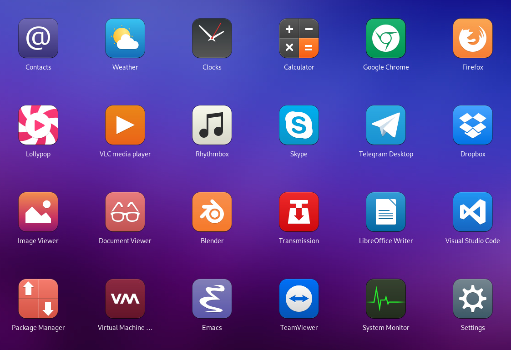

# MokaPlus Icon Theme

## About

MokaPlus is an updated version of the original [Moka icon theme](https://github.com/snwh/moka-icon-theme), which is no longer actively maintained. This version improves compatibility with modern desktop environments and expands the original set with additional icons.

## Installation

## Credits

The Moka icon theme was created by [Sam Hewitt](https://samuelhewitt.com). All credits for the initial design and concept go to him. Additional icons were sourced from the following projects:

- [moka-extra-icons](https://github.com/aldomann/moka-extra-icons)
- [elementary-xfce](https://github.com/shimmerproject/elementary-xfce)
- [mint-y-icons](https://github.com/linuxmint/mint-y-icons)

## License

This project is licensed under the same terms as the original Moka icons project. For more details, please read the LICENSE file included in this repository.

## Contact

For questions, feedback, or support, you can reach me at: public@zoltankiraly.com.